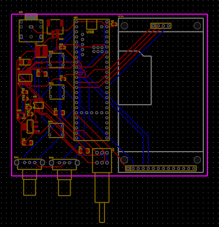

# Frequency_Generator_For_Healing

This is a adjustable frequency generator using an Teensy 4.1 development board's built in DSP library. It produces precise audio frequencies for all sorts of health needs, such as sleeping, meditating, or even studying. The device also offers a touchscreen, customizable frequency selection, waveform generation. I'm developing a feature to custom draw a waveform on the touchscreen to hear what sound it produces. All electronics are neatly housed in a custom-designed 3D-printed enclosure.

I made this project because I love music and sound, and wanted to make a project dedicated to my music passion that is useful at the same time. It is particularly helpful for personal meditation, sound therapy, or group sessions in remote locations. 

## Images

### 3D Model

*Custom-designed 3D-printed enclosure for the frequency generator*

### PCB Design

*Custom PCB design for the frequency generator circuit*

### Wiring Diagram

*Complete wiring diagram showing all connections*

## Bill of Materials (BOM)

| No. | Quantity | Comment | Footprint | Value | Secondary Category | Links | Supplier | Price |
|-----|----------|---------|-----------|-------|--------------------|-------|----------|-------|
| 1 | 2 | 10uF | C1206 | 10uF | Multilayer Ceramic Capacitors MLCC - SMD/SMT | [Link](https://www.digikey.com/en/products/detail/kemet/C1206X106J3RACTU/7427565) | Digikey | 32.16 |
| 2 | 2 | 22uF | C1206 | 22uF | Multilayer Ceramic Capacitors MLCC - SMD/SMT | [Link](https://www.digikey.com/en/products/detail/yageo/CC1206MKX5R8BB226/7164406) | Aliexpress | 10.8 |
| 3 | 1 | SJ1-3523N | AUDIO-TH_SJ1-3523N | | Audio Connectors | [Link](https://www.digikey.com/en/products/detail/same-sky-formerly-cui-devices/SJ1-3523N/738689) | Amazon | 47.1 |
| 4 | 1 | JST-PH-2-SMT-RA | CONN-SMD_JST-PH-2-SMT-RA | | | | JCLPCB | 5.3 |
| 5 | 1 | DO-214AC | SMA_L4.3-W2.6-LS5.2-RD | 22uH | | [Link](https://www.digikey.com/en/products/detail/smc-diode-solutions/S1G/6022594) | EBAY | 13.99 |
| 6 | 1 | CD54 | IND-SMD_L5.8-W5.2_CD54-4R7MT | | | [Link](https://www.digikey.com/en/products/detail/sumida-america-inc/CD54NP-220MC/2108185?s=N4IgjCBcoEwAwA4DsVQGMoDMCGAbAzgKYA0IA9lANogwwAEArQBIgC6pADgC5QgCqAOwCWXAPKYAsoWz4ArgCdCIAL6kAtDFQgMkLvNklyVEAFY2y1TWMBhACImALOaA) | | 109.35 |
| 7 | 1 | 220R | R0603 | | | [Link](https://www.digikey.com/en/products/detail/stackpole-electronics-inc/RMCF0603FT220R/1760809) | | |
| 8 | 1 | 10kΩ | RES-ADJ-TH_RK097221005C | 10kΩ | Potentiometers, Variable Resistors | [Link](https://www.aliexpress.us/item/3256805258177673.html?spm=a2g0o.productlist.main.1.60b65889MKYmTE&algo_pvid=969d1b48-7d98-41ef-ae64-f030e5c2409d&algo_exp_id=969d1b48-7d98-41ef-ae64-f030e5c2409d-0&pdp_ext_f=%7B%22order%22%3A%2272%22%2C%22eval%22%3A%221%22%2C%22fromPage%22%3A%22search%22%7D&pdp_npi=6%40dis%21USD%215.22%210.99%21%21%2136.35%216.89%21%402101d6ff17668561695985316e4f78%2112000033106284816%21sea%21US%210%21ABX%211%210%21n_tag%3A-29910%3Bd%3A58a15ccf%3Bm03_new_user%3A-29895%3BpisId%3A5000000187462899&curPageLogUid=ljufiTLKoDgT&utparam-url=scene%3Asearch%7Cquery_from%3A%7Cx_object_id%3A1005005444492425%7C_p_origin_prod%3A&tblci=GiDWlI48SukOJiZfQxR9L5qNctXASPXAMPpTwmBVj_Lp2iCnqXUo5cKyjp_-jtF7MJ_bXg) | | |
| 9 | 1 | 15k | R0603 | | | [Link](https://www.digikey.com/en/products/detail/stackpole-electronics-inc/RMCF0603FT15K0/1760774) | | |
| 10 | 1 | 2.2k | R0603 | | | [Link](https://www.digikey.com/en/products/detail/yageo/RC0603FR-072K2L/727016) | | |
| 11 | 2 | EC110104S2A-VA1-006 | EC11-TH_EC110104S2A-VA1-006 | | | [Link](https://www.digikey.com/en/products/detail/alps-alpine/EC11E18244AU/19529126) | | |
| 12 | 3 | Switch_SW_Push | SW-TH_4P-L7.2-W7.2-P4.50-S6.5_TC-02 | SW_Push | | | | |
| 13 | 1 | 2.4" TFT (SPI 240x320) | 2.4_TFT_SPI_240x320 | | | [Link](https://www.ebay.com/itm/204415217707?_skw=2.4+Inch+SPI+240x320&itmmeta=01KDGHCQ2DY0RESMG9P2SSCK8T&hash=item2f9818b02b:g:L2AAAOSwwHNl3ubL&itmprp=enc%3AAQAKAAAA8FkggFvd1GGDu0w3yXCmi1dHE7trGbreQIzJacNXGBeVlOalfs21yyh8cGXX6p71frBJ7sne52nyVSyYBHj%2Bfk9NQ7kEoVa%2B8pgpL1CSn%2FMiV1H2hxsbGJFR%2FQtpkqw6eYMv8AKlqRytHCjn65iK3Wj9ScVl10mpo4gPx2ieHNr7kWhEcYidOJgug3BnGu69sxIM8JpkZi3aOPoJhnhDkGnjZgwaW4LGx2XXtNMnzd7TTFmTQXbOKOcje6EF1LDvkwoe6IYItaFZxsOv%2FaE9Ae3LL6D6Ay8QHR5bSVIaw3A%2FEMU3KgM5htM5eVdh3j9EWg%3D%3D%7Ctkp%3ABFBMrPGykexm) | | |
| 14 | 1 | PCM5102APWR | TSSOP-20_L6.5-W4.4-P0.65-LS6.4-BL | | | [Link](https://www.digikey.com/en/products/detail/texas-instruments/PCM5102APWR/3727211) | | |
| 15 | 3 | 100nF | C0603 | 100nF | | [Link](https://www.digikey.com/en/products/detail/yageo/CC0603KRX7R7BB104/302822) | | |
| 16 | 1 | C0603 | C0603 | 10uF | | [Link](https://www.digikey.com/en/products/detail/yageo/CC0603KRX5R5BB106/5195190) | | |
| 17 | 1 | MCP1826S-3302E/DB | SOT-223-3_L6.7-W3.7-P2.30-LS7.0-BR | | Voltage Regulators - Linear, Low Drop Out (LDO) Regulators | [Link](https://www.digikey.com/en/products/detail/microchip-technology/MCP1826S-3302E-DB/1635997) | | |
| 18 | 1 | OPA1678IDR | SOIC-8_L5.0-W4.0-P1.27-LS6.0-BL | | Operational Amplifier | [Link](https://www.digikey.com/en/products/detail/texas-instruments/OPA1678IDR/7034940) | | |
| 19 | 1 | MT3608 | SOT-23-6_L2.9-W1.6-P0.95-LS2.8-BL | | DC-DC Converters | [Link](https://www.aliexpress.us/item/3256809007855182.html?spm=a2g0o.productlist.main.3.c1b059faELlVg2&aem_p4p_detail=20251227013517149090838069500001607234&algo_pvid=75a0059d-9b3a-4e13-91bf-7ad3bc89e252&algo_exp_id=75a0059d-9b3a-4e13-91bf-7ad3bc89e252-2&pdp_ext_f=%7B%22order%22%3A%2272%22%2C%22eval%22%3A%221%22%2C%22fromPage%22%3A%22search%22%7D&pdp_npi=6%40dis%21USD%210.89%210.87%21%21%216.20%216.08%21%402101c59117668281173148904e1b30%2112000048259742678%21sea%21US%210%21ABX%211%210%21n_tag%3A-29910%3Bd%3A194d952e%3Bm03_new_user%3A-29895&curPageLogUid=WlA0bLUF7Gw8&utparam-url=scene%3Asearch%7Cquery_from%3A%7Cx_object_id%3A1005009194169934%7C_p_origin_prod%3A&search_p4p_id=20251227013517149090838069500001607234_3&tblci=GiDWlI48SukOJiZfQxR9L5qNctXASPXAMPpTwmBVj_Lp2iCnqXUo5cKyjp_-jtF7MJ_bXg) | | |
| 20 | 1 | TEENSY 4.1 | COMM-TH_L60.1-W17.8-P2.54 | | | [Link](https://www.amazon.com/PJRC-Teensy-4-1-with-Pins/dp/B08CTM3279/ref=sr_1_2?crid=AN14N2TPN78G&dib=eyJ2IjoiMSJ9.sJ78Urlha2ogIlIbQCYBEvczjDk2Mak3MoWtWtg2liPFkgenST7QhfydLUZkOFAGKGzV0EppQPFofYU984_5btScR-oYyGcK_egEvwEq1rdtyueUkyvCL-wQN8Cf-0Cz0nYtNfbUZa_2lUeTWzzYAiih3vVlTEtvoOqaEEv0HdioCaKvLWdWsBzSWioNtN3Ir-4geGTnV40rgk3jbHAA-6S-8Pf8wW1elpl5Fh_svPtl50KfBE6sfPTJDjAubCZaBkwzHiQm4fwQp9LQ5Nk7DRK-ug1kZHOGgd7SXEj9j0g.mAbp2yrqRE6BUvuclwv9w05iRcbhv0xduawu2gIDfIU&dib_tag=se&keywords=teensy+4.1&qid=1766824248&s=electronics&sprefix=teensy+%2Celectronics%2C864&sr=1-2) | | |
| PCB | 1 | | | | | | | |
| 4 | 1 | JST-PH-2-SMT-RA | CONN-SMD_JST-PH-2-SMT-RA | | | |
| 5 | 1 | DO-214AC | SMA_L4.3-W2.6-LS5.2-RD | 22uH | | [Link](https://www.digikey.com/en/products/detail/smc-diode-solutions/S1G/6022594) |
| 6 | 1 | CD54 | IND-SMD_L5.8-W5.2_CD54-4R7MT | | | [Link](https://www.digikey.com/en/products/detail/sumida-america-inc/CD54NP-220MC/2108185?s=N4IgjCBcoEwAwA4DsVQGMoDMCGAbAzgKYA0IA9lANogwwAEArQBIgC6pADgC5QgCqAOwCWXAPKYAsoWz4ArgCdCIAL6kAtDFQgMkLvNklyVEAFY2y1TWMBhACImALOaA) |
| 7 | 1 | 220R | R0603 | | | [Link](https://www.digikey.com/en/products/detail/stackpole-electronics-inc/RMCF0603FT220R/1760809) |
| 8 | 1 | 10kΩ | RES-ADJ-TH_RK097221005C | 10kΩ | Potentiometers, Variable Resistors | [Link](https://www.aliexpress.us/item/3256805258177673.html?spm=a2g0o.productlist.main.1.60b65889MKYmTE&algo_pvid=969d1b48-7d98-41ef-ae64-f030e5c2409d&algo_exp_id=969d1b48-7d98-41ef-ae64-f030e5c2409d-0&pdp_ext_f=%7B%22order%22%3A%227%22%2C%22eval%22%3A%221%22%2C%22fromPage%22%3A%22search%22%7D&pdp_npi=6%40dis%21USD%215.22%210.99%21%21%2136.35%216.89%21%402101d6ff17668561695985316e4f78%2112000033106284816%21sea%21US%210%21ABX%211%210%21n_tag%3A-29910%3Bd%3A58a15ccf%3Bm03_new_user%3A-29895%3BpisId%3A5000000187462899&curPageLogUid=ljufiTLKoDgT&utparam-url=scene%3Asearch%7Cquery_from%3A%7Cx_object_id%3A1005005444492425%7C_p_origin_prod%3A&tblci=GiDWlI48SukOJiZfQxR9L5qNctXASPXAMPpTwmBVj_Lp2iCnqXUo5cKyjp_-jtF7MJ_bXg) |
| 9 | 1 | 15k | R0603 | | | [Link](https://www.digikey.com/en/products/detail/stackpole-electronics-inc/RMCF0603FT15K0/1760774) |
| 10 | 1 | 2.2k | R0603 | | | [Link](https://www.digikey.com/en/products/detail/yageo/RC0603FR-072K2L/727016) |
| 11 | 2 | EC110104S2A-VA1-006 | EC11-TH_EC110104S2A-VA1-006 | | | [Link](https://www.digikey.com/en/products/detail/alps-alpine/EC11E18244AU/19529126) |
| 12 | 3 | Switch_SW_Push | SW-TH_4P-L7.2-W7.2-P4.50-S6.5_TC-02 | SW_Push | | |
| 13 | 1 | 2.4" TFT (SPI 240x320) | 2.4_TFT_SPI_240x320 | | | [Link](https://www.ebay.com/itm/204415217707?_skw=2.4+Inch+SPI+240x320&itmmeta=01KDGHCQ2DY0RESMG9P2SSCK8T&hash=item2f9818b02b:g:L2AAAOSwwHNl3ubL&itmprp=enc%3AAQAKAAAA8FkggFvd1GGDu0w3yXCmi1dHE7trGbreQIzJacNXGBeVlOalfs21yyh8cGXX6p71frBJ7sne52nyVSyYBHj%2Bfk9NQ7kEoVa%2B8pgpL1CSn%2FMiV1H2hxsbGJFR%2FQtpkqw6eYMv8AKlqRytHCjn65iK3Wj9ScVl10mpo4gPx2ieHNr7kWhEcYidOJgug3BnGu69sxIM8JpkZi3aOPoJhnhDkGnjZgwaW4LGx2XXtNMnzd7TTFmTQXbOKOcje6EF1LDvkwoe6IYItaFZxsOv%2FaE9Ae3LL6D6Ay8QHR5bSVIaw3A%2FEMU3KgM5htM5eVdh3j9EWg%3D%3D%7Ctkp%3ABFBMrPGykexm) |
| 14 | 1 | PCM5102APWR | TSSOP-20_L6.5-W4.4-P0.65-LS6.4-BL | | | [Link](https://www.digikey.com/en/products/detail/texas-instruments/PCM5102APWR/3727211) |
| 15 | 3 | 100nF | C0603 | 100nF | | [Link](https://www.digikey.com/en/products/detail/yageo/CC0603KRX7R7BB104/302822) |
| 16 | 1 | C0603 | C0603 | 10uF | | [Link](https://www.digikey.com/en/products/detail/yageo/CC0603KRX5R5BB106/5195190) |
| 17 | 1 | MCP1826S-3302E/DB | SOT-223-3_L6.7-W3.7-P2.30-LS7.0-BR | | Voltage Regulators - Linear, Low Drop Out (LDO) Regulators | [Link](https://www.digikey.com/en/products/detail/microchip-technology/MCP1826S-3302E-DB/1635997) |
| 18 | 1 | OPA1678IDR | SOIC-8_L5.0-W4.0-P1.27-LS6.0-BL | | Operational Amplifier | [Link](https://www.digikey.com/en/products/detail/texas-instruments/OPA1678IDR/7034940) |
| 19 | 1 | MT3608 | SOT-23-6_L2.9-W1.6-P0.95-LS2.8-BL | | DC-DC Converters | [Link](https://www.aliexpress.us/item/3256809007855182.html?spm=a2g0o.productlist.main.3.c1b059faELlVg2&aem_p4p_detail=20251227013517149090838069500001607234&algo_pvid=75a0059d-9b3a-4e13-91bf-7ad3bc89e252&algo_exp_id=75a0059d-9b3a-4e13-91bf-7ad3bc89e252-2&pdp_ext_f=%7B%22order%22%3A%2272%22%2C%22eval%22%3A%221%22%2C%22fromPage%22%3A%22search%22%7D&pdp_npi=6%40dis%21USD%210.89%210.87%21%21%216.20%216.08%21%402101c59117668281173148904e1b30%2112000048259742678%21sea%21US%210%21ABX%211%210%21n_tag%3A-29910%3Bd%3A194d952e%3Bm03_new_user%3A-29895&curPageLogUid=WlA0bLUF7Gw8&utparam-url=scene%3Asearch%7Cquery_from%3A%7Cx_object_id%3A1005009194169934%7C_p_origin_prod%3A&search_p4p_id=20251227013517149090838069500001607234_3&tblci=GiDWlI48SukOJiZfQxR9L5qNctXASPXAMPpTwmBVj_Lp2iCnqXUo5cKyjp_-jtF7MJ_bXg) |
| 20 | 1 | TEENSY 4.1 | COMM-TH_L60.1-W17.8-P2.54 | | | [Link](https://www.amazon.com/PJRC-Teensy-4-1-with-Pins/dp/B08CTM3279/ref=sr_1_2?crid=AN14N2TPN78G&dib=eyJ2IjoiMSJ9.sJ78Urlha2ogIlIbQCYBEvczjDk2Mak3MoWtWtg2liPFkgenST7QhfydLUZkOFAGKGzV0EppQPFofYU984_5btScR-oYyGcK_egEvwEq1rdtyueUkyvCL-wQN8Cf-0Cz0nYtNfbUZa_2lUeTWzzYAiih3vVlTEtvoOqaEEv0HdioCaKvLWdWsBzSWioNtN3Ir-4geGTnV40rgk3jbHAA-6S-8Pf8wW1elpl5Fh_svPtl50KfBE6sfPTJDjAubCZaBkwzHiQm4fwQp9LQ5Nk7DRK-ug1kZHOGgd7SXEj9j0g.mAbp2yrqRE6BUvuclwv9w05iRcbhv0xduawu2gIDfIU&dib_tag=se&keywords=teensy+4.1&qid=1766824248&s=electronics&sprefix=teensy+%2Celectronics%2C864&sr=1-2) |
| **Total:** | **$109.35** |